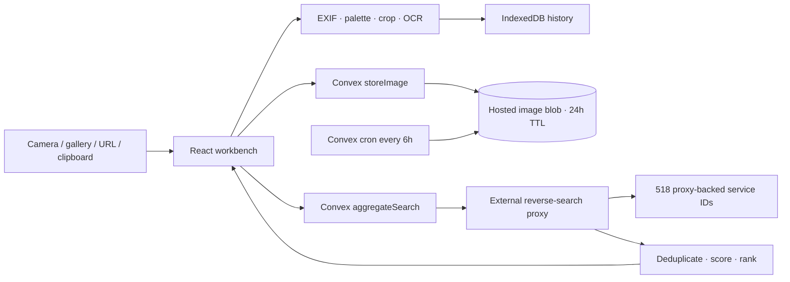

# The Image Inquisitor

A vintage image-intelligence workbench for tracing a picture across a configurable reverse-search catalog. The client is a Vite + React PWA; Convex stores only short-lived hosted image blobs and forwards searches to an external headless proxy.

## Architecture



## What is included

- **518-entry `EngineRegistry`**: verified seed services plus stable proxy routing variants. Generated entries are configuration IDs, not invented provider endpoints; the proxy owns the adapters.
- **Advanced Options**: search, tier grouping, region filters, availability filters, bulk selection, and GPS-driven regional suggestions.
- **External proxy contract**: one ephemeral Convex action accepts a hosted image URL and selected engine IDs, then returns a normalized ranked result list without storing results.
- **Image analysis**: crop, EXIF/GPS, palette tinting, perceptual hash, OCR, and Exa/self-hosted text research.
- **Privacy-first history**: search history remains in IndexedDB. Convex hosted blobs are removed by the cleanup cron after 24 hours.
- **Installable PWA**: responsive layout and iOS Safari “Add to Home Screen” guidance.

<details>
<summary>Configure the external proxy</summary>

Add these values in the project’s **Keys/API keys** tab. Never commit them to a local file:

| Variable | Purpose |
| --- | --- |
| `RIS_PROXY_URL` | HTTPS endpoint implementing the aggregate-search contract |
| `RIS_PROXY_KEY` | Bearer credential accepted by that endpoint |

The proxy receives:

```json
{
  "imageUrl": "https://.../convex-file-url",
  "engineIds": ["google-lens", "bing", "google-lens-jp"]
}
```

It should return either `results` or `matches`:

```json
{
  "results": [
    {
      "id": "stable-result-id",
      "title": "A matching page",
      "sourceUrl": "https://example.com/page",
      "imageUrl": "https://example.com/image.jpg",
      "thumbnailUrl": "https://example.com/thumb.jpg",
      "width": 1200,
      "height": 800,
      "score": 0.94,
      "matchType": "exact",
      "services": ["google-lens", "bing"]
    }
  ]
}
```

The proxy is responsible for provider-specific adapters, queueing, deduplication, terms-of-service compliance, and its own ephemeral processing policy.

</details>

<details>
<summary>Development</summary>

```bash
bun install
bun convex dev --once
bun tsc -b --noEmit
```

The managed Freebuff environment runs the Vite and Convex development processes. Do not start a second dev server or edit generated Convex files by hand.

</details>

## Repository map

- `src/lib/engines.ts` — 518-entry registry and UI metadata
- `src/convex/aggregate.ts` — external proxy action and response normalization
- `src/convex/inquiries.ts` — ephemeral image hosting
- `src/convex/crons.ts` — six-hour cleanup sweep
- `src/components/inquisitor/Engines.tsx` — service catalog and ranked results
- `src/pages/Inquisitor.tsx` — pipeline orchestration
- `src/lib/history.ts` — browser-only IndexedDB history

## Privacy

Images are uploaded only when a hosted URL is required by the proxy. The hosted image record is swept after 24 hours. Search responses are held in React state for the current workbench session and are not written to Convex. Browser history is stored locally in IndexedDB.
