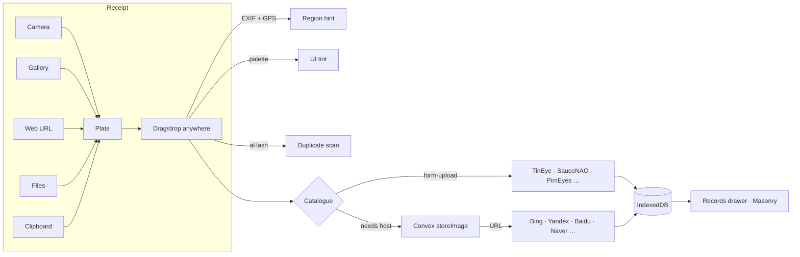
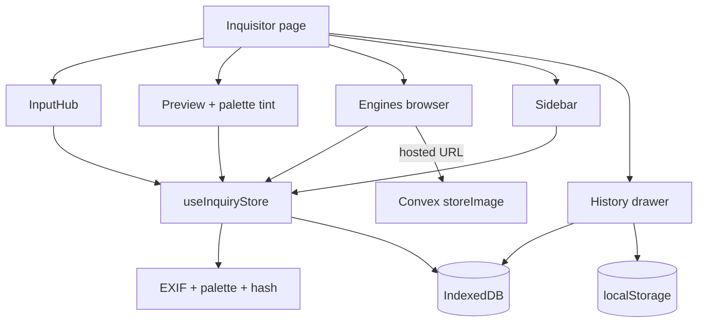

# The Image Inquisitor

> A vintage reverse-image engineering workbench for the web.

Take a photograph, drop a frame, paste from the clipboard, or fetch from the web —
the Inquisitor pulls **EXIF, palette, perceptual hash**, and reads the image
against **41 reverse-image services** organised into **4 tiers**, all from a
mobile-first, installable, vintage sepia PWA.

No accounts. No tracking. Search history is locked to your browser's IndexedDB.

---

## How a reverse-image inquiry flows



---

## Features at a glance

- **Five modes of receipt** — camera, gallery, web URL, files, clipboard plus
  paste-anywhere (⌘/Ctrl-V) and drop-anywhere.
- **EXIF reading** — camera, lens, ISO, aperture, date, and **GPS lat/lon**.
- **GPS-driven regional auto-tick** — Yandex & FindClone for Russian plates;
  Baidu, Sogou, Naver, trace.moe for East-Asian plates; Ecosia for European.
- **Palette extraction** — k-means top-5 dominant pigments, with **dynamic UI
  tinting** that pulls the brass and burgundy accents toward the plate's mood.
- **Perceptual seal** — 64-bit aHash (Hamming-similarity duplicate spotting).
- **Format converter** — JPEG ⇄ PNG ⇄ WebP with quality slider.
- **Cropper** — freehand drag-resize with preset aspect ratios.
- **41-engine catalogue** organised into **four tiers**:
  - **Tier I**: Google Lens · Bing · Yandex · TinEye · Baidu · Sogou · Naver · Qihoo · Picsearch · Mail.ru · Ecosia
  - **Tier II**: Lenso.ai · PimEyes · FaceCheck.ID · Search4Faces · Berify · FindClone
  - **Tier III**: Pinterest · Amazon · eBay · AliExpress · Shutterstock · Getty · Alamy · iStock · Adobe Stock · GIPHY
  - **Tier IV**: SauceNAO · ASCII2D · IQDB · 3DIQI · trace.moe · WhatAnime · Karma Decay · ImageRaider · Snapdraw · Noop · Google RIS · Yandex (RU) · TinEye Multicolor · SearchEngine.Report
- **History drawer** with **CSS-columns masonry** and **filter chips** for
  Face / Exact-Match / E-Commerce / Anime / Stock.
- **iOS / Android installable** — `display: standalone`, `apple-touch-icon`,
  192/512/maskable icons, service-worker offline shell.
- **Privacy-first** — no server account, no tracking, history in IndexedDB
  only.

---

## Quick start

<details>
<summary><strong>Local development</strong></summary>

This project is set up already and runs on a cloud environment + Convex dev in
the sandbox. To run it elsewhere:

```bash
bun install
bun convex dev --once    # ensure Convex types are generated
bun dev                  # start Vite
```

Open `http://localhost:5173` and click **Open Workbench**. From iOS Safari,
tap share → *Add to Home Screen*.

</details>

<details>
<summary><strong>Environment variables</strong></summary>

The project is set up with project-specific `CONVEX_DEPLOYMENT` and
`VITE_CONVEX_URL` environment variables on the client side.

The Convex server has its own set, currently:

- `JWKS`
- `JWT_PRIVATE_KEY`
- `SITE_URL`

These are managed through the **Keys / API keys** UI — *do not* commit a
`.env` file.

</details>

<details>
<summary><strong>Privacy posture</strong></summary>

- No analytics or third-party tracking pixels.
- No server-side history of user actions.
- Image blobs are stored in your browser's `IndexedDB`. Each record can be
  deleted individually from the **Records** drawer.
- The Convex `storeImage` action is the *only* network write — strictly used
  to give URL-mode engines a publicly reachable image URL. New uploads each
  dispatch cycle; old URLs become orphaned and are not referenced from the
  UI.

See [`docs/privacy.md`](./docs/privacy.md) for the long form.

</details>

---

## Service registry & dispatcher

Engines declare a **Tier**, **Region**, **Feature**, and a **Mode**
(`form-upload` or `url-open`). The Inquisitor:

1. Reads the active plate's EXIF; if GPS is present, it derives a Region and
   pre-ticks the matching engines (the **regional hint banner**).
2. Uploads the plate through Convex `storeImage` only if the chosen set
   includes any `url-open` engine.
3. Dispatches every selected engine either by submitting a hidden multipart
   form (for `form-upload`) or by `window.open(engine.urlBuilder(hostedUrl))`.

See [`docs/adding-services.md`](./docs/adding-services.md) for the registry
schema and how to add a new service.

---

## Architecture



Read [`docs/architecture.md`](./docs/architecture.md) for the full topology.

---

## Vintage design system

The Inquisitor's mood is muted sepia / aged-paper. Token names live in
`src/index.css`; see [`docs/vintage-design-system.md`](./docs/vintage-design-system.md).
The active plate's dominant pigment dynamically retints the brass & burgundy
accents via CSS custom properties.

---

## Service status

| Engine tier | Count | Mode(s) |
|---|---:|---|
| Tier I — Major | 11 | form-upload + url-open |
| Tier II — Facial/AI | 6 | form-upload + url-open |
| Tier III — E-com & Stock | 10 | form-upload + url-open |
| Tier IV — Niche & Specialty | 14 | form-upload + url-open |
| **Total** | **41** | |

Tiers reflected in `src/lib/engines.ts`.

---

## Wiki

- [Architecture](./docs/architecture.md)
- [Adding new services](./docs/adding-services.md)
- [Privacy policy](./docs/privacy.md)
- [Vintage design system](./docs/vintage-design-system.md)
- [API reference](./docs/api-reference.md)

---

## Tech stack

Vite · React 19 · Tailwind v4 · shadcn/ui · Convex · Convex Auth · Framer
Motion · IndexedDB. Detailed conventions live in the original `README`
appendix lower in this repo (kept for the Freebuff template).
