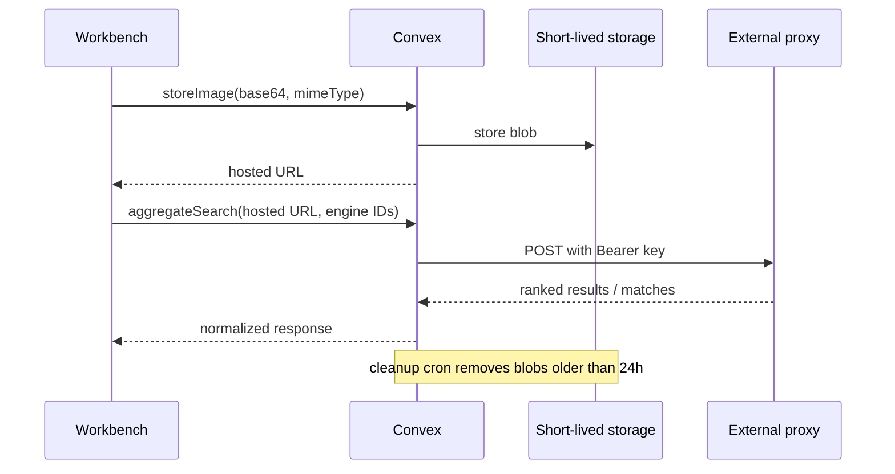

# Architecture

The Inquisitor remains a Vite + React + Convex application. Provider-specific reverse-image integrations are deliberately outside the client and Convex runtime.

`src/lib/engines.ts` exposes `EngineRegistry`, exactly 518 routing records. Verified seeds retain descriptive metadata; generated variants are honest proxy lanes with `supported: false` until the proxy enables them.

The proxy request is authenticated server-side with `RIS_PROXY_KEY`. The browser never receives that key and never calls provider APIs directly.
