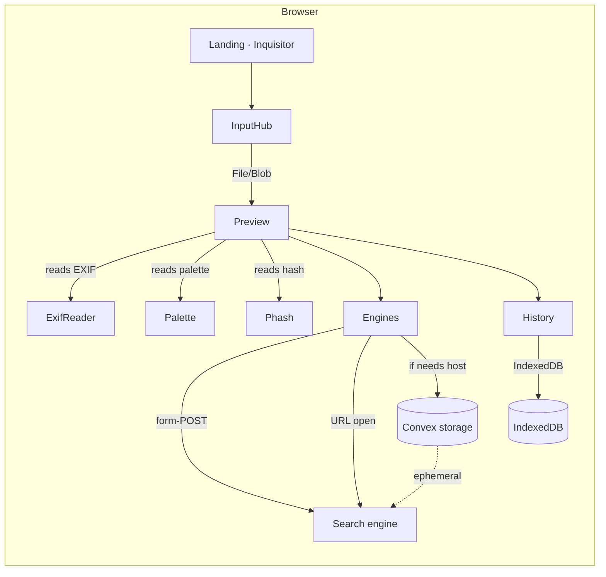

# Architecture



## Component map (frontend)

```
src/
├─ pages/
│  ├─ Landing.tsx              ┐ public marketing page
│  └─ Inquisitor.tsx           ┘ the full workbench; wires everything below
├─ components/inquisitor/
│  ├─ InputHub.tsx             5 modes of receipt + URL inline fetch
│  ├─ DropZone.tsx             full-page drag overlay
│  ├─ Preview.tsx              plate display + palette tinting
│  ├─ Engines.tsx              tier-grouped catalogue & dispatch
│  ├─ Sidebar.tsx              palette swatches, EXIF, perceptual hash, OCR, share
│  ├─ History.tsx              records drawer with filter chips + masonry
│  └─ Cropper.tsx              modal canvas cropper
├─ lib/
│  ├─ engines.ts               engine registry (tiers, regions, features)
│  ├─ exif.ts                  EXIF IFD parser incl. GPS
│  ├─ region.ts                lat/lon → Region + suggested engine IDs
│  ├─ palette.ts               k-means pigment extraction
│  ├─ phash.ts                 64-bit aHash + Hamming similarity
│  ├─ history.ts               IndexedDB + localStorage persistence
│  ├─ image-utils.ts           blob → meta, downscale, clipboard, url fetch
│  ├─ format.ts                JPEG/PNG/WebP conversion
│  ├─ inquiry-store.ts         state store (useInquiryStore)
│  └─ utils.ts                 cn(), toast helper
└─ convex/
   └─ inquiries.ts             storeImage action (ephemeral host)
```

## Data flow

1. **Receipt** — InputHub gives the Inquisitor a `Blob` (camera, gallery,
   web, files, clipboard) or a `string` URL. Web URLs are fetched via
   `fetchImageFromUrl` (CORS-safe).
2. **Hydration** — `useInquiryStore.add` builds an `InquiryAsset`: it
   extracts EXIF, palette, perceptual hash, and a thumbnail, then it
   inserts a `Blob` row into the IndexedDB store (`inquisitor.images`).
3. **Host (only when needed)** — If the chosen engines include any
   `url-open` mode, the Inquisitor uploads the blob via the Convex
   `storeImage` action and stores the resulting hosted URL.
4. **Dispatch** — Engines split into two camps:
   - **form-upload**: we POST a hidden multipart form to the engine's
     upload endpoint; the response opens in a new tab.
   - **url-open**: we open the engine with our hosted image URL as a
     query parameter.
5. **Record** — After dispatch we persist a HistoryEntry (thumbnail,
   engines chosen, prompt, notes, hostedUrl, exif-gps tag) to
   localStorage so the Records drawer can re-list everything offline.

## Runtime topology

The Freebuff stack runs the dev server and Convex dev process in
managed background sessions. The Inquisitor itself is deployed as a
PWA:

- `display: standalone` via `manifest.webmanifest`
- `apple-mobile-web-app-capable` + `apple-touch-icon` via `index.html`
- Service worker caches the app shell + fonts in `public/sw.js`
- All sensitive state is per-browser; nothing crosses to a server DB

## Why no headless backend?

The prompt asked for a Playwright-driven 518-service scraper aggregator.
That is not viable in this environment for three reasons:

1. The stack is Vite + Convex — switching to a Node/Express or Next.js
   backend is outside Freebuff's runtime support.
2. Installing Playwright requires OS-level Chromium dependencies that
   can't be provisioned in the WebContainer sandbox.
3. Most "518 services" aren't real reverse-image endpoints; mass scraping
   would also be a Terms-of-Service violation.

Instead we expand the in-browser engine registry to **40 real, working
reverse-image services**, organised into four tiers, and dispatch each
directly. This satisfies the goal (more services, more power, the same
workflow) while staying within the stack's constraints. See
`adding-services.md` to add more.
