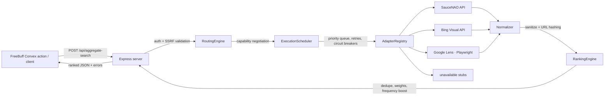

# RIS External Proxy

> Reverse-image-search aggregation gateway. Accepts a short-lived public image URL plus a list of engine IDs, executes **only configured adapters** (official APIs + headless browser automation), then normalizes, deduplicates, and ranks the matches into one unified JSON response — without persisting images or search history.

[](https://github.com/Alot1z/image-artisan-guild/actions/workflows/ci.yml)

## Architecture



Pipeline: `Request → Validation → Capability Negotiation → Routing Engine → Execution Scheduler → Explicit Provider Registry → Adapters → Normalizer → Ranking Engine → Response`

## Features

- **Explicit provider registry** — adapters self-register (`registry.register(new Adapter())`); no filesystem scanning or dynamic module discovery.
- **Plugin lifecycle** — every adapter implements `warmup() / initialize() / execute() / cleanup()`.
- **Layered configuration** — `Defaults ← JSON config ← environment variables`. Concurrency, retries, timeouts, cache sizes, circuit thresholds, and per-engine ranking weights are all configurable.
- **Priority scheduler** — `user_requested > recommended > optional`, configurable concurrency, per-adapter retry/timeout policy, and circuit breakers with half-open recovery probes.
- **Multi-level caching** — `SearchCache` (aggregate responses), `NormalizedCache` (per-engine results), `HealthCache` (adapter health).
- **Ranking** — canonical-URL hashing for dedup, confidence normalized to 0–1, configurable source weights, frequency boosting.
- **Observability** — `trace_id` / `correlation_id` per request, structured JSON logs with latency, cache hits, and circuit trips.
- **Security** — DNS-resolved SSRF rejection, timing-safe bearer auth, 32 KB body limit, credential-isolated logs.

## Quick start

<details>
<summary>Local development</summary>

```bash
cd proxy
cp ENV.example .env     # template only — never commit real secrets
bun install
bun run build           # type-check + compile to dist/
bun run test            # unit + integration suites
RIS_PROXY_KEY=local-secret bun run dev
```

</details>

## Configuration

See [ENV.example](ENV.example) for the full list. Key variables:

| Variable | Purpose |
| --- | --- |
| `RIS_PROXY_KEY` | **Required** bearer secret shared with the FreeBuff Convex action |
| `SAUCENAO_API_KEY` | Enables the SauceNAO adapter |
| `BING_VISUAL_SEARCH_API_KEY` | Enables the Bing Visual Search adapter |
| `GOOGLE_LENS_UPLOAD_URL` | Lens upload-by-URL endpoint (default `https://lens.google.com/uploadbyurl`) |
| `GOOGLE_LENS_RESULTS_TIMEOUT_MS` | How long to wait for the Lens results DOM |
| `RIS_BROWSER_HEADLESS`, `RIS_BROWSER_VIEWPORT_*`, `RIS_BROWSER_USER_AGENT`, `RIS_BROWSER_LOCALE`, `RIS_BROWSER_TIMEZONE` | Headless-browser fingerprint tuning |
| `RIS_MAX_CONCURRENCY` | Scheduler concurrency (max 15) |
| `RIS_ADAPTER_TIMEOUT_MS`, `RIS_MAX_RETRIES` | Per-adapter execution policy |
| `RIS_CACHE_TTL_MS`, `RIS_CACHE_MAX_ENTRIES` | Cache sizing |
| `RIS_CIRCUIT_FAILURE_THRESHOLD`, `RIS_CIRCUIT_RESET_TIMEOUT_MS` | Circuit-breaker policy |
| `RIS_MAX_RESULTS` | Ranked result cap |

Per-engine **ranking weights** come from an optional JSON config (`RIS_CONFIG_PATH`):

```json
{ "weights": { "saucenao": 1.2, "bing": 0.8 } }
```

## API

### `POST /api/aggregate-search`

Bearer-authenticated. Body: `{ "imageUrl": "...", "engineIds": [...] }` (`engine_ids` also accepted for compatibility).

```bash
curl -sS -X POST http://localhost:3000/api/aggregate-search \
  -H "Authorization: Bearer $RIS_PROXY_KEY" \
  -H "Content-Type: application/json" \
  -d '{"imageUrl":"https://example.com/photo.jpg","engineIds":["saucenao","bing","google-lens","tineye"]}'
```

Response:

```json
{
  "status": "success",
  "request_id": "uuid",
  "total_results": 42,
  "results": [
    {
      "source_engine": "saucenao",
      "url": "https://found.example/image.jpg",
      "thumbnail": "https://found.example/thumb.jpg",
      "confidence": 0.92,
      "metadata": { "domain": "found.example", "title": "Archived plate", "dimensions": "1200x800" }
    }
  ],
  "errors": [{ "engine_id": "tineye", "error": "Adapter execution failed" }]
}
```

- Results are sanitized, deduplicated by canonical URL hash, weighted, and sorted by confidence.
- **Partial success** — a failing adapter never aborts the aggregate; its reason lands in `errors`.
- Repeat requests are served from the `SearchCache`.
- Trace headers `x-trace-id` and `x-correlation-id` are echoed on every response.

### `GET /health`

Unauthenticated liveness probe → `{ "status": "ok", "service": "ris-external-proxy", "cache_entries": N }`.

### `GET /api/adapters`

Lists registered adapters with capabilities and live health (no auth).

## Adapter status

| Adapter | Integration | Status |
| --- | --- | --- |
| `saucenao` | Official API | Works when `SAUCENAO_API_KEY` is set |
| `bing` | Official API | Works when `BING_VISUAL_SEARCH_API_KEY` is set |
| `google-lens` | Playwright (Chromium) | Real browser automation; blocked pages fail gracefully and trip the circuit breaker |
| `tineye` | — | Honest unavailable stub; requires an account-specific permitted API contract |
| Other IDs | — | Dynamic stubs return structured errors — never fake results |

## Testing

```bash
cd proxy
bun run test    # full suite: HTTP contract, scheduler/router, adapter mocks, pipeline, end-to-end (currently 33 tests)
```

- Mocked adapter tests never touch the network (injected `fetch` / fake browser contexts).
- The integration suite boots the real Express app and drives the complete pipeline with mocked upstream HTTP.
- The test script injects deterministic credentials at the process level so the app singleton is configured identically for every test file (use `bun run test`, not bare `bun test`).

## Deployment

<details>
<summary>Docker</summary>

The image is based on the official Playwright Noble image (Chromium + all OS-level deps pre-installed), builds as an unprivileged user, and healthchecks `/health`.

```bash
docker build -t ris-external-proxy ./proxy   # context must be the proxy directory
docker run --rm -p 3000:3000 \
  -e RIS_PROXY_KEY=local-secret \
  --init ris-external-proxy
```

</details>

<details>
<summary>Render / Fly.io</summary>

`render.yaml` (Render Blueprint) points the Docker context at `./proxy` and exposes `RIS_PROXY_KEY`, `SAUCENAO_API_KEY`, and `BING_VISUAL_SEARCH_API_KEY` as secret env vars. `fly.toml` is provided for Fly.io. Set secrets in the platform's secret manager — never in the repo.

</details>

The managed Freebuff app points `RIS_PROXY_URL` at the deployed `/api/aggregate-search` endpoint and uses the same `RIS_PROXY_KEY`.

## Security & privacy

- Only HTTP(S) image URLs; DNS-resolved rejection of private, loopback, link-local, metadata, multicast, and reserved IPs.
- Timing-safe bearer comparison; 32 KB body cap; at most 518 engine IDs per request.
- Results sanitized to bounded HTTP(S) URLs and text (XSS-safe).
- Structured logs never include URLs, credentials, or raw upstream payloads.
- **Nothing is persisted** — caches are in-memory and TTL-bounded; no user data, images, or search history is written to disk or a database.

## Repository layout

```text
proxy/
├── src/
│   ├── adapters/
│   │   ├── api/baseApiAdapter.ts          # reusable API base (retries, timeouts)
│   │   ├── api/sauceNaoAdapter.ts         # SauceNAO official API
│   │   ├── browser/baseBrowserAdapter.ts  # Playwright lifecycle + stealth options
│   │   ├── browser/googleLensAdapter.ts   # Google Lens automation
│   │   ├── base.ts                        # interfaces + safe helpers
│   │   ├── bing.ts                        # Bing Visual Search official API
│   │   ├── manager.ts                     # registry → router → scheduler wiring
│   │   ├── saucenao.ts                    # compatibility re-export
│   │   └── stubs.ts                       # honest unavailable adapters
│   ├── core/
│   │   ├── cache.ts                       # SearchCache / NormalizedCache / HealthCache
│   │   ├── config.ts                      # layered config provider
│   │   ├── normalizer.ts                  # URL hashing + response sanitization
│   │   ├── observability.ts               # trace/correlation ids + structured logs
│   │   ├── ranker.ts                      # dedup, weights, frequency boost
│   │   ├── registry.ts                    # explicit provider registry
│   │   ├── router.ts                      # capability negotiation
│   │   └── scheduler.ts                   # priority queue + circuit breakers
│   ├── cache.ts                           # backward-compatible re-export
│   ├── config.ts
│   ├── logging.ts
│   ├── security.ts
│   ├── server.ts                          # Express routes, auth, trace headers
│   ├── types.ts
│   └── index.ts                           # boot + graceful shutdown
├── tests/
│   ├── setup.ts                           # shared upstream fetch dispatcher
│   ├── core.test.ts
│   ├── saucenao.test.ts
│   ├── googleLens.test.ts
│   ├── pipeline.test.ts
│   ├── server.test.ts
│   └── integration.test.ts
├── Dockerfile
├── render.yaml
├── fly.toml
├── ENV.example
└── package.json
```
